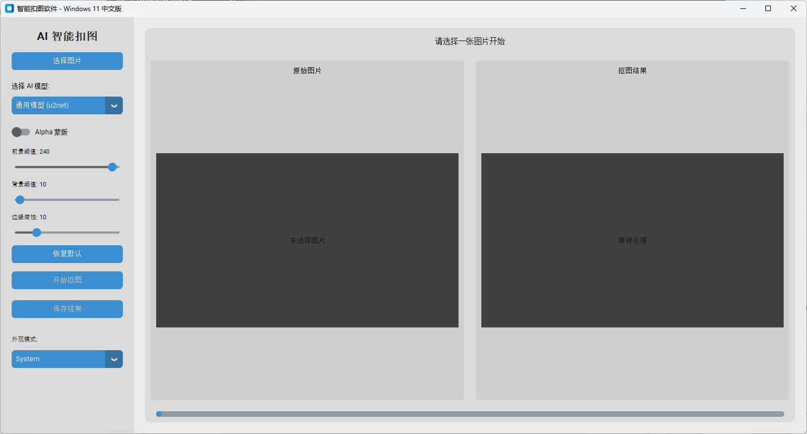

# AI 智能扣图软件 (Windows 11 中文版)

一款基于 AI 技术的桌面扣图软件，专为 Windows 11 用户设计，提供简洁直观的中文界面。支持多种 AI 模型切换、边缘 Alpha 蒙版调节，并针对 16:9 宽屏图片进行了界面优化。



## ✨ 主要功能

- **🚀 智能抠图**：集成 `rembg` (U2-Net) 核心，一键精准去除背景。
- **🎨 现代 UI**：使用 `customtkinter` 打造的 Windows 11 风格界面，支持深色/浅色模式。
- **🛠️ 自由更换模型**：
  - 通用模型 (u2net)
  - 轻量模型 (u2netp)
  - 人像优化 (human)
  - 衣物优化 (cloth)
  - 物体优化 (silueta)
  - 新一代通用 (isnet)
- **🎛️ 专业调节选项**：
  - **Alpha 蒙版**：开启后可获得更平滑的边缘处理。
  - **阈值调节**：自定义前景与背景的识别敏感度。
  - **边缘腐蚀**：微调边缘收缩程度，去除残留像素。
- **📺 16:9 优化**：界面布局完美适配 1280x720 等宽屏图片的并排对比显示。
- **📝 日志记录**：自动生成 `error.log`，方便排查闪退等异常情况。

## 📦 安装要求

在开始之前，请确保您的系统中已安装：

- [Python 3.8+](https://www.python.org/downloads/)
- Windows 10 或 Windows 11

## 🛠️ 安装步骤

1. **克隆仓库** (或直接下载源代码):
   ```bash
   git clone https://github.com/syscca/kotu.git
   cd kotu
   ```

2. **安装依赖** (建议使用虚拟环境):
   ```bash
   pip install -r requirements.txt
   ```

3. **运行软件**:
   ```bash
   python main.py
   ```

## 🚀 使用指南

1. **选择图片**：点击左侧边栏的“选择图片”按钮，支持 PNG, JPG, JPEG, WEBP 等格式。
2. **选择模型**：根据图片内容选择合适的 AI 模型（如人像选择“人像优化”）。
3. **参数调节** (可选)：开启“Alpha 蒙版”并调节滑动条以优化边缘。
4. **开始抠图**：点击按钮，等待 AI 处理（首次运行会下载模型，请保持网络畅通）。
5. **保存结果**：点击“保存结果”导出透明背景的 PNG 图片。

## ❓ 常见问题

- **软件闪退怎么办？**
  - 请查看目录下生成的 `error.log` 文件。
  - 确保网络正常，因为首次运行需要从 GitHub 下载模型文件。
  - 尝试重新安装 ONNX 运行库：`pip install --force-reinstall onnxruntime`。
- **处理速度慢？**
  - 首次运行下载模型较慢，后续处理速度取决于您的 CPU/GPU 性能。
  - 推荐使用“轻量模型 (u2netp)”以获得更快的速度。

## 📄 开源协议

本项目采用 [MIT License](LICENSE) 许可。
